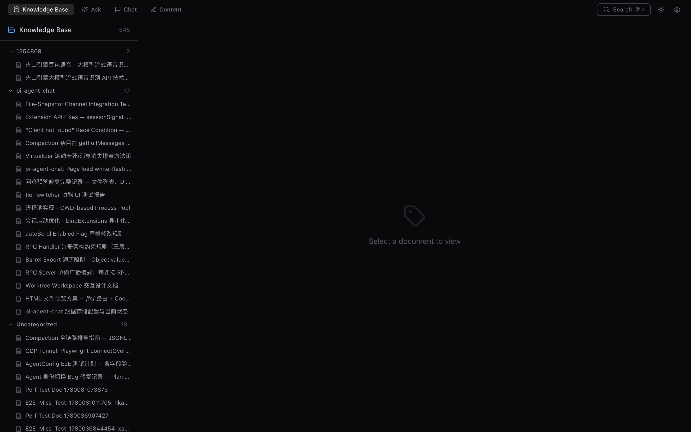
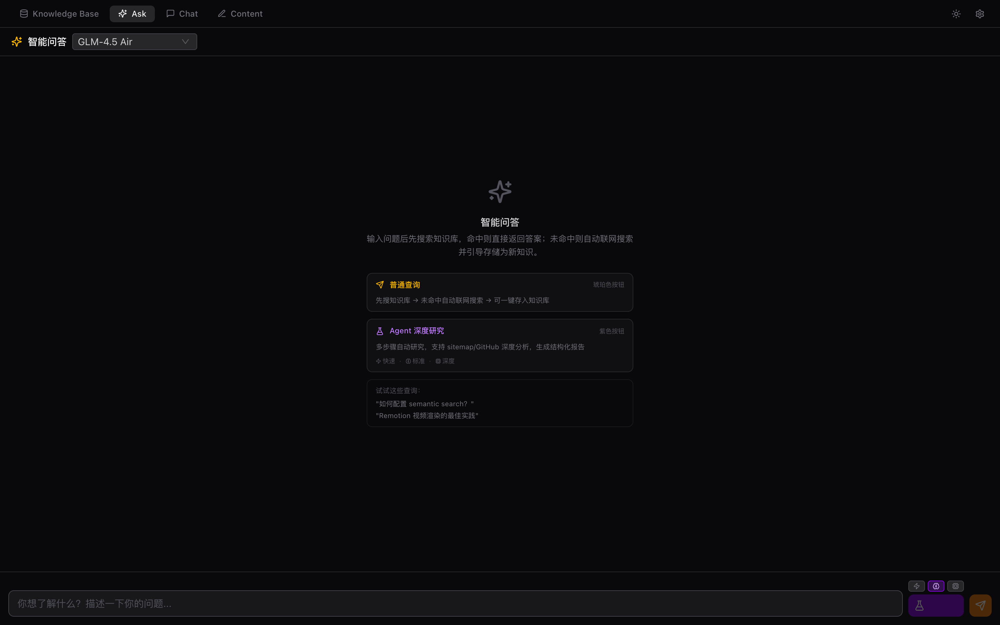
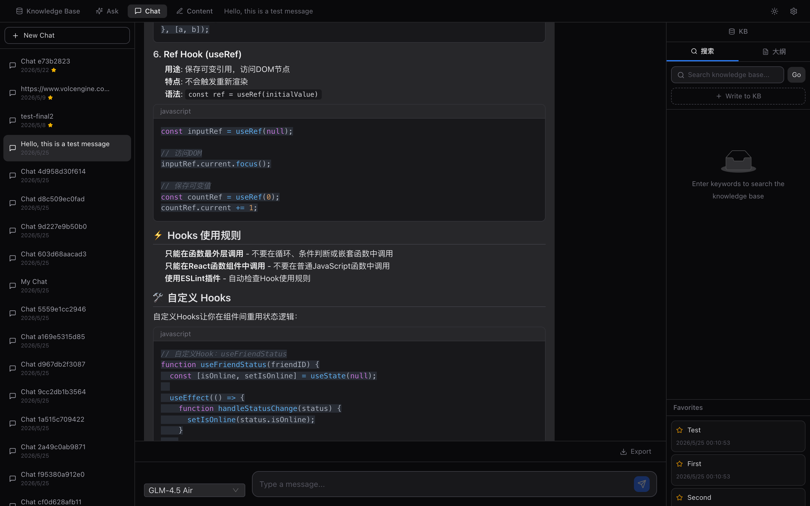
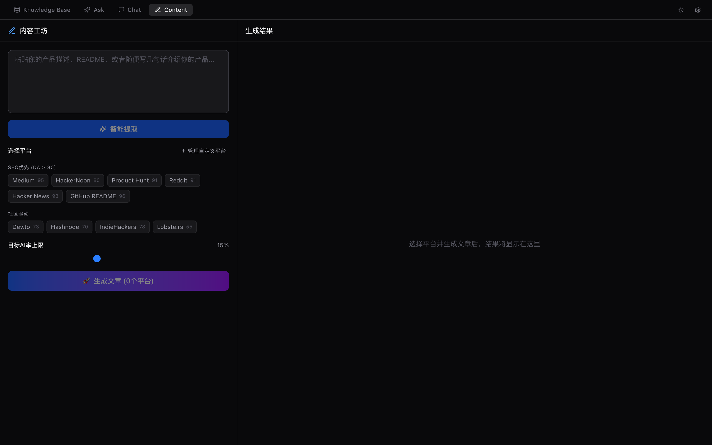
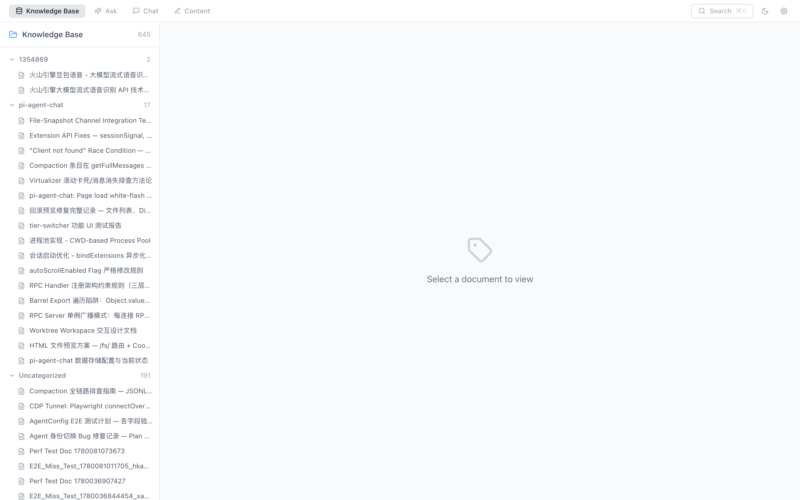

# Knowledge Base MCP

跨项目的知识库 MCP 服务，支持三层搜索（文本匹配 / TF-IDF / 语义向量），提供 Web UI 管理界面。

## 功能特性

- **18 个 MCP 工具** — kb_write / kb_read / kb_search / kb_search_semantic / kb_list / kb_delete / kb_update / kb_outline / kb_recent / kb_ask / kb_ingest_url / kb_ingest_repo / kb_stale_check / kb_auto_link / kb_suggest / file_read / file_grep / file_exists
- **三层搜索架构** — P0 文本匹配 + P1 TF-IDF + P2 多语言语义向量，加权融合排序
- **多语言语义搜索** — 基于 `paraphrase-multilingual-MiniLM-L12-v2`，支持 50+ 语言跨语言检索
- **自进化闭环** — kb_ask miss → Agent 联网搜索 → kb_ingest_url 存储 → 下次秒回
- **Miss 日志分析** — 记录高频未命中查询，kb_suggest 推荐预抓取主题
- **双传输模式** — Stdio（本地 MCP 客户端）+ HTTP（StreamableHTTP / SSE / REST API）
- **Web UI** — Vite 6 + React 18 + Zustand + Tailwind + Ant Design

## 截图预览

| Knowledge Base · 知识库管理 | Ask · 智能问答 |
|:---:|:---:|
|  |  |

| Chat · AI 对话 | Content · 内容工作台 |
|:---:|:---:|
|  |  |

| Light Mode · 浅色主题 |
|:---:|
|  |

## 快速开始

### npx 一键启动（推荐）

无需克隆仓库，直接运行：

```bash
# Stdio 模式
npx @dyyz1993/kb-mcp --stdio

# HTTP 模式
npx @dyyz1993/kb-mcp --http --port 19877
```

### 全局安装（可选）

```bash
npm install -g @dyyz1993/kb-mcp
kb-mcp --stdio
```

### 从源码构建

```bash
git clone https://github.com/dyyz1993/knowledge-base-mcp.git
cd knowledge-base-mcp
bun install
```

首次使用语义搜索时，需要预先下载 embedding 模型：

```bash
bun run -e '
import { pipeline, env } from "@huggingface/transformers"
import { join } from "node:path"
import { homedir } from "node:os"
env.localModelPath = join(homedir(), ".cache/huggingface/local-models")
env.allowLocalModels = true
await pipeline("feature-extraction", "Xenova/paraphrase-multilingual-MiniLM-L12-v2", { dtype: "fp32" })
console.log("Model downloaded")
'
```

语义搜索（P2）为可选功能。未安装 `@huggingface/transformers` 时，P0 文本匹配和 P1 TF-IDF 搜索仍正常工作。如果不下载模型，语义搜索（P2）不可用，但文本匹配（P0）和 TF-IDF（P1）仍正常工作。

## OpenCode 配置

### Stdio 模式（推荐本地使用）

编辑 `~/.config/opencode/opencode.json`，在 `mcp.servers` 中添加：

```json
{
  "mcp": {
    "servers": {
      "knowledge-base": {
        "type": "local",
        "command": ["npx", "@dyyz1993/kb-mcp", "--stdio"]
      }
    }
  }
}
```

无需手动启动，OpenCode 会自动管理进程生命周期。

### StreamableHTTP 模式（远程服务器）

先启动服务：

```bash
npx @dyyz1993/kb-mcp --http --port 19877
```

配置：

```json
{
  "mcp": {
    "servers": {
      "knowledge-base": {
        "type": "streamable-http",
        "url": "http://your-server:19877/mcp"
      }
    }
  }
}
```

### SSE 模式（旧版客户端）

```json
{
  "mcp": {
    "servers": {
      "knowledge-base": {
        "type": "sse",
        "url": "http://your-server:19877/sse"
      }
    }
  }
}
```

## Claude Desktop 配置

### Stdio 模式（推荐本地使用）

编辑 Claude Desktop 配置文件，在 `mcpServers` 中添加：

```json
{
  "mcpServers": {
    "knowledge-base": {
      "command": "npx",
      "args": [
        "@dyyz1993/kb-mcp",
        "--stdio"
      ],
      "type": "stdio"
    }
  }
}
```

无需手动启动，Claude Desktop 会自动管理进程生命周期。

### SSE 模式（推荐远程服务器）

先启动服务：

```bash
npx @dyyz1993/kb-mcp --http --web --port 19877
```

配置：

```json
{
  "mcpServers": {
    "knowledge-base": {
      "url": "http://localhost:19877/sse",
      "type": "sse"
    }
  }
}
```

访问 http://localhost:19877 查看 Web UI 管理界面。


## Web UI

```bash
# 一条命令同时启动 MCP API + Web UI
npx @dyyz1993/kb-mcp --http --web --port 19877
```

访问 http://localhost:19877 查看 Web UI。

## MCP 工具

### 知识库工具

| 工具 | 说明 |
|---|---|
| `kb_write` | 保存知识文档，支持标签、关键词、来源项目等元数据 |
| `kb_read` | 读取文档内容，超 50 行自动截断 |
| `kb_search` | 文本 + 关键词 + 标签多维搜索 |
| `kb_search_semantic` | 语义向量搜索，支持跨语言检索 |
| `kb_list` | 浏览文档列表，按标签或项目过滤 |
| `kb_delete` | 删除文档，同步更新索引 |
| `kb_update` | 更新文档正文、标题、标签、关键词 |
| `kb_outline` | 获取指定项目的文档大纲 |
| `kb_recent` | 获取最近插入的文档，支持按时间范围过滤 |

### 自进化工具

| 工具 | 说明 |
|---|---|
| `kb_ask` | 智能查询：先搜知识库，miss 时返回结构化 Miss Task 引导 Agent 搜索后存储 |
| `kb_ingest_url` | 摄入 URL 内容到知识库（Agent 用 web-reader/xbrowser 抓取后调用），自动 resolve miss |
| `kb_ingest_repo` | 克隆 GitHub 仓库并分析目录结构 + 关键文件，生成知识文档 |
| `kb_suggest` | 基于 miss 日志分析，推荐应预抓取的高频未命中主题 |
| `kb_stale_check` | 检查知识库中 related_files 引用的文件是否已变更 |
| `kb_auto_link` | 自动发现知识库中语义相关的文档，返回关联建议 |

### 文件访问工具（适用于远程访问）

| 工具 | 说明 |
|---|---|
| `file_read` | 通过绝对路径读取文件内容，支持 offset 和 limit 参数 |
| `file_grep` | 在指定文件中搜索文本内容，支持正则表达式 |
| `file_exists` | 检查文件或目录是否存在 |

### kb_write 参数

```typescript
{
  title: string              // 文档标题
  content: string            // 正文（Markdown）
  tags: string[]             // 标签：tutorial / document / analysis / guide / snippet / best-practice / reference / architecture / troubleshooting / decision
  keywords: string[]         // 关键词，用于检索
  intent: string             // 创建意图或使用场景
  project_description: string // 当前项目简要描述
  source_project?: string    // 来源项目路径（自动填充）
  source_worktree?: string   // 来源 worktree 路径（自动填充）
}
```

### file_read 参数

```typescript
{
  path: string           // 文件绝对路径
  offset?: number        // 起始行号（默认 0）
  limit?: number         // 读取行数（默认 2000）
}
```

### file_grep 参数

```typescript
{
  path: string           // 文件绝对路径
  pattern: string       // 搜索文本或正则表达式
  case_sensitive?: boolean  // 是否区分大小写（默认 false）
  regex?: boolean       // 是否使用正则表达式（默认 true）
}
```

### file_exists 参数

```typescript
{
  path: string           // 文件/目录绝对路径
}
```

### kb_ask 参数

```typescript
{
  query: string                // 自然语言查询
  max_web_results?: number     // 联网搜索最大结果数（默认 3，当前未使用）
  auto_save?: boolean          // 是否自动存入知识库（默认 true，当前未使用）
}
```

**返回值**：
- KB 命中：`{ from_kb: true, id, title, score, content, hint }`
- KB 未命中（Miss）：`{ from_kb: false, miss: true, suggested_workflow, alternative_workflows, hint }`

### kb_ingest_url 参数

```typescript
{
  url: string                  // 来源 URL
  title: string                // 文档标题
  content: string              // 页面内容（Markdown 格式）
  tags?: string[]              // 标签（默认 ["reference", "auto-ingested"]）
  keywords?: string[]          // 关键词（不填则从标题自动提取）
}
```

### kb_ingest_repo 参数

```typescript
{
  repo: string                 // GitHub 仓库（owner/repo 格式，如 oven-sh/bun）
  max_files?: number           // 最多读取文件数（默认 20）
}
```

### kb_recent 参数

```typescript
{
  hours?: number               // 查询最近多少小时（默认 24）
  limit?: number               // 最大返回数量（默认 50）
  include_content?: boolean    // 是否返回完整内容（默认 false）
}
```

### kb_suggest 参数

```typescript
{
  limit?: number               // 返回建议数量（默认 10）
}
```

### kb_stale_check 参数

```typescript
{}  // 无参数，自动检查所有带 related_files 的文档
```

### kb_auto_link 参数

```typescript
{
  doc_id?: string              // 指定文档 ID（不指定则分析最近 10 篇）
  threshold?: number           // 语义相似度阈值 0-1（默认 0.7）
}
```

## 自进化闭环

```
用户查询 → kb_ask
  ├── KB 命中（score ≥ 40）→ 直接返回，无需联网
  └── KB 未命中 → 返回 Miss Task
        ├── suggested_workflow:
        │     step_1: web-search-prime(query)
        │     step_2: web-reader(url)
        │     step_3: kb_ingest_url(url, title, content)
        └── alternative_workflows:
              • GitHub: zread(repo) → kb_ingest_url()
              • JS 渲染: agent-browser → kb_ingest_url()
              • 本地项目: kb_ingest_repo(repo_url)

Agent 执行搜索 → kb_ingest_url 存储 → resolveMiss → 下次查询直接命中
kb_suggest 分析高频 miss → 推荐预抓取主题
```

## REST API

以下端点仅在 HTTP 模式下可用。

| 方法 | 路径 | 说明 |
|---|---|---|
| GET | `/health` | 健康检查 |
| GET | `/api/docs` | 列出所有文档 |
| GET | `/api/doc/:id` | 读取指定文档 |
| POST | `/api/search` | 综合搜索（三层融合） |
| POST | `/api/search/semantic` | 语义搜索 |
| GET | `/api/outline?project=...` | 获取项目大纲 |

## 搜索架构

```
查询 → ┌─ P0: 文本匹配（标题/关键词/意图） ──── 权重 0.2
       ├─ P1: TF-IDF（加权词频 + 余弦相似度） ── 权重 0.3
       └─ P2: 语义向量（384维 embedding + 余弦相似度） ── 权重 0.5
         ↓
       加权融合 → 排序返回 TopK
```

| 层级 | 算法 | 特点 | 场景 |
|---|---|---|---|
| P0 | 子串匹配 + 字段加权 | 精确、快速 | 已知关键词 |
| P1 | TF-IDF + 余弦相似度 | 中文 bigram 分词，加权字段 | 模糊匹配 |
| P2 | multilingual-MiniLM + 余弦相似度 | 50+ 语言跨语言语义匹配 | 自然语言查询 |

`kb_search` 使用 P0，`kb_search_semantic` 使用 P2，HTTP `/api/search` 使用三层融合。

## 存储结构

所有数据存储在 `~/.knowledge/`（可通过 `KB_DIR` 环境变量自定义）：

```
~/.knowledge/
├── index.json              # 文档索引
├── vectors.json            # 语义向量缓存
├── outlines/               # 项目大纲
│   └── {project-slug}.json
├── {id}-{title-slug}.md    # 文档文件（YAML frontmatter + Markdown 正文）
└── ...
```

单个文档文件示例：

```markdown
---
id: "abc123xyz"
title: "React Hooks 最佳实践"
tags: ["best-practice"]
keywords: ["react", "hooks", "useEffect"]
intent: "React 开发中 hooks 的常见模式和陷阱"
project_description: "前端组件库项目"
source_project: "/Users/x/project-frontend"
created_at: 1746012345678
---

## 使用 useEffect 的注意事项
...
```

## 测试

```bash
bun test
```

## 环境变量

| 变量 | 默认值 | 说明 |
|---|---|---|
| `KB_DIR` | `~/.knowledge` | 知识库存储目录 |
| `PORT` | `19877` | HTTP 模式端口（也可用 `--port` 参数） |

## License

MIT
